# Gen1 Pokedex - Complete Project Documentation

A full-stack Pokemon collection and battle game built with **Java Spring Boot** backend and **React + Vite** frontend. Explore all 151 Generation 1 Pokemon, build your collection, battle other trainers, and climb the leaderboard!

**Status:** ✅ Development Ready  
**Backend:** Java Spring Boot + MySQL  
**Frontend:** React 19 + Vite + Tailwind CSS  
**Architecture:** REST API + JWT Authentication

---

## 📋 Table of Contents

- [Project Overview](#-project-overview)
- [System Architecture](#-system-architecture)
- [Quick Start](#-quick-start)
- [Project Structure](#-project-structure)
- [Features](#features)
- [Gen1 Pokedex Snippets](#-gen1-pokedex-snippets)
- [API Documentation](#-api-documentation)
- [Frontend Documentation](#-frontend-documentation)
- [Backend Documentation](#-backend-documentation)
- [Development Workflow](#-development-workflow)
- [Deployment Guide](#-deployment-guide)
- [Troubleshooting](#-troubleshooting)
- [Contributing](#-contributing)

---

## 📖 Project Overview

### What is Gen1 Pokedex?

Gen1 Pokedex is a web application that lets you:

✅ **Explore & Discover** - Browse all 151 original Generation 1 Pokemon with full stats  
✅ **Catch & Collect** - Build your unique Pokemon collection  
✅ **Level & Evolve** - Train Pokemon to higher levels and unlock evolution forms  
✅ **Battle** - Simulate battles with type effectiveness and stat calculations  
✅ **Compete** - Join the leaderboard and track your progress  
✅ **Complete Pokedex** - Work toward catching all 151 Pokemon  

### Key Features

| Category | Features |
|----------|----------|
| **Authentication** | Registration, Login, Password Recovery, Session Management |
| **Pokemon** | 151 Gen1 Pokemon, Full Stats, Type System, Abilities |
| **Collection** | Catch, Release, Favorites, Level Tracking, Completion % |
| **Evolution** | 20+ Evolution Chains, Level Requirements, Visual Display |
| **Battle** | Real-time Simulator, Type Effectiveness, XP Rewards |
| **Gamification** | 5 Achievement Badges, Daily Challenges, Leaderboard |
| **Administration** | User Management, Pokemon CRUD, Audit Logging |
| **Responsive** | Mobile-friendly, Desktop Optimized, Accessible |

---

## 🏗️ System Architecture

```
┌─────────────────────────────────────────────────────────────┐
│                    Frontend (React + Vite)                   │
│  ┌──────────────────────────────────────────────────────┐  │
│  │  Landing → Auth → Dashboard → Pokedex/Battle/Admin  │  │
│  │  Styling: Tailwind CSS + Custom Components          │  │
│  │  State: Context API + React Query                   │  │
│  └────────────┬─────────────────────────────────────────┘  │
│               │ (HTTP/JSON)                                  │
│  ┌────────────▼─────────────────────────────────────────┐  │
│  │        REST API (Port 8080)                          │  │
│  │  Authentication → Pokemon → User → Battle → Admin    │  │
│  │  JWT Token Authorization                            │  │
│  └────────────┬─────────────────────────────────────────┘  │
└─────────────┼───────────────────────────────────────────────┘
              │
┌─────────────▼───────────────────────────────────────────────┐
│           Backend (Spring Boot + MySQL)                     │
│  ┌───────────────────────────────────────────────────┐  │
│  │  Controllers → Services → Repositories → Database │  │
│  │  Authentication: JWT + Spring Security            │  │
│  │  Database: 13 Entity Models                       │  │
│  └───────────────────────────────────────────────────┘  │
└─────────────────────────────────────────────────────────────┘
```

---

## 🚀 Quick Start

### Prerequisites

**Backend:**
- Java Development Kit (JDK) 11+
- Maven 3.8+
- MySQL 8.0+

**Frontend:**
- Node.js 18+
- npm or yarn

### Step 1: Start Backend

```bash
cd gen1pokedex

# Install dependencies (if needed)
mvn clean install

# Run Spring Boot application
./mvnw.cmd spring-boot:run
```

Wait for message: `Started Gen1pokedexApplication in ...`

**Backend ready at:** `http://localhost:8080`

---

### Step 2: Start Frontend

In a new terminal:

```bash
cd gen1pokedex-frontend

# Install dependencies
npm install

# Start development server
npm run dev
```

**Frontend ready at:** `http://localhost:5173`

---

### Step 3: Open Application

1. Open browser: http://localhost:5173
2. Click "Start Playing"
3. Login with:
   - **Username:** `trainer1`
   - **Password:** `test123`

✅ Application is ready!

---

## 📁 Project Structure

```
Generation1Pokedex/
│
├── gen1pokedex/                    # Backend (Spring Boot)
│   ├── src/main/java/com/gen1pokedex/
│   │   ├── controller/            # REST endpoints
│   │   ├── service/               # Business logic
│   │   ├── repository/            # Database access
│   │   ├── entity/                # Data models
│   │   ├── dto/                   # Data transfer objects
│   │   ├── exception/             # Error handling
│   │   ├── security/              # JWT & Auth
│   │   ├── seeder/                # Database initialization
│   │   └── config/                # Application config
│   ├── src/main/resources/
│   │   ├── application.properties # Configuration
│   │   └── ...
│   ├── pom.xml                    # Maven dependencies
│   ├── README.md                  # Backend documentation
│   └── mvnw/mvnw.cmd             # Maven wrapper
│
├── gen1pokedex-frontend/           # Frontend (React + Vite)
│   ├── src/
│   │   ├── components/            # React components
│   │   │   ├── auth/
│   │   │   ├── dashboard/
│   │   │   ├── pokedex/
│   │   │   ├── battle/
│   │   │   ├── admin/
│   │   │   └── common/
│   │   ├── contexts/              # Context API
│   │   ├── services/              # API services
│   │   ├── assets/                # Images, icons
│   │   ├── App.jsx                # Main component
│   │   ├── main.jsx               # Entry point
│   │   └── index.css              # Global styles
│   ├── public/                    # Static files
│   ├── package.json               # Dependencies
│   ├── vite.config.js             # Build config
│   ├── tailwind.config.js         # Tailwind config
│   ├── README.md                  # Frontend documentation
│   └── ...
│
├── .github/                       # GitHub workflows
├── .git/                          # Git version control
├── README.md                      # This file
└── docs/                          # Additional documentation and screenshots

```

---

## ✨ Features

### Frontend Features

- ✅ User Authentication (Register, Login, Forgot Password)
- ✅ Pokemon Discovery (Browse, Search, Filter)
- ✅ Collection Management (Catch, Release, Favorites)
- ✅ Evolution System (Level-up and evolve Pokemon)
- ✅ Battle Simulator (Real-time battles with XP rewards)
- ✅ User Dashboard (Profile, Stats, Leaderboard)
- ✅ Daily Challenges (Streak tracking, rewards)
- ✅ Admin Panel (User & Pokemon management)
- ✅ Responsive Design (Mobile-friendly)
- ✅ Sound Effects (Optional background music)

### Backend Features

- ✅ RESTful API (All CRUD operations)
- ✅ JWT Authentication (Stateless, secure)
- ✅ User Management (Registration, Ban, Suspend)
- ✅ Pokemon Database (151 Gen1 Pokemon)
- ✅ Evolution Chains (20+ supported)
- ✅ Leveling System (100 XP per level)
- ✅ Battle Engine (Type effectiveness, stat calculations)
- ✅ Achievement System (5 badges)
- ✅ Audit Logging (All admin actions tracked)
- ✅ Error Handling (Comprehensive exception handling)

---

## Gen1 Pokedex Snippets

## Kanto Region Map (with all 151 Pokemon locations)
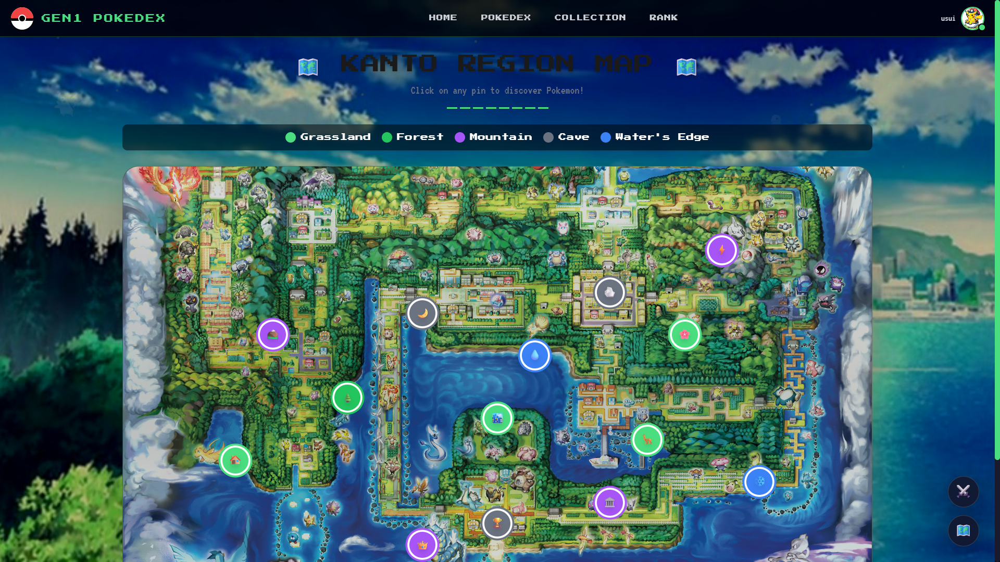

## User Journey
1. Landing Page
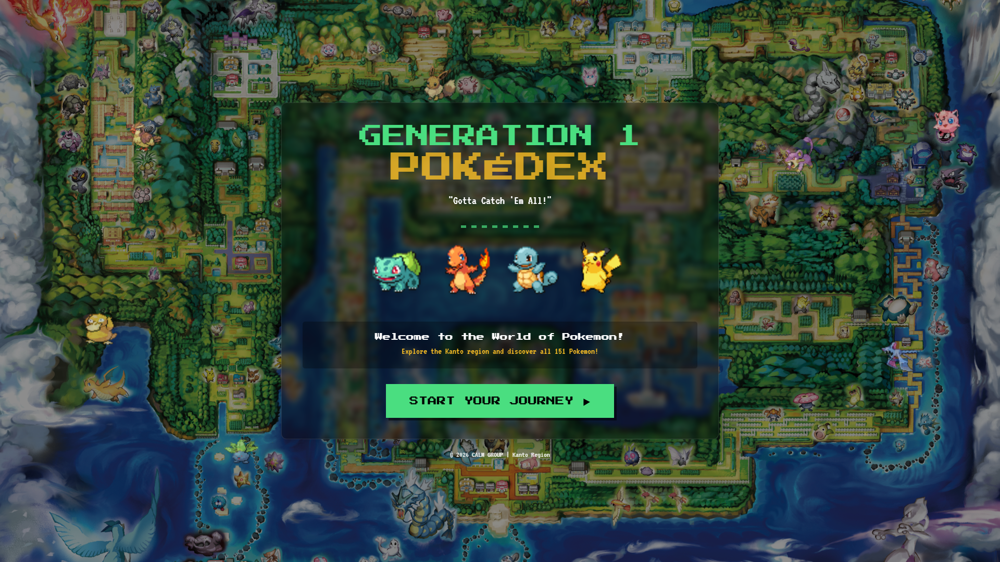

2. Registration
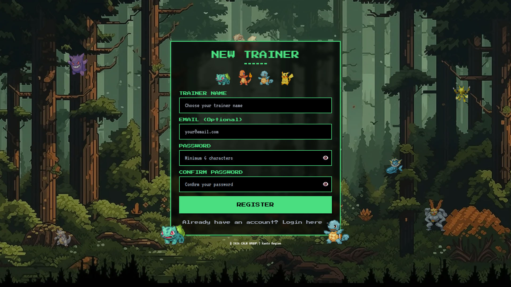

3. Login Page
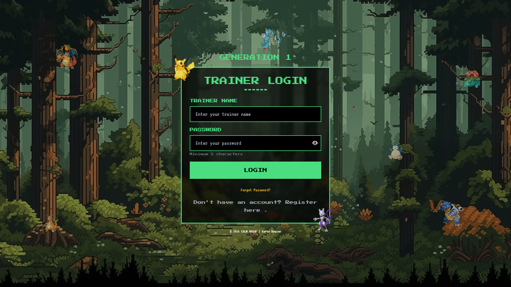

## Core Features
1. Pokedex Explorer
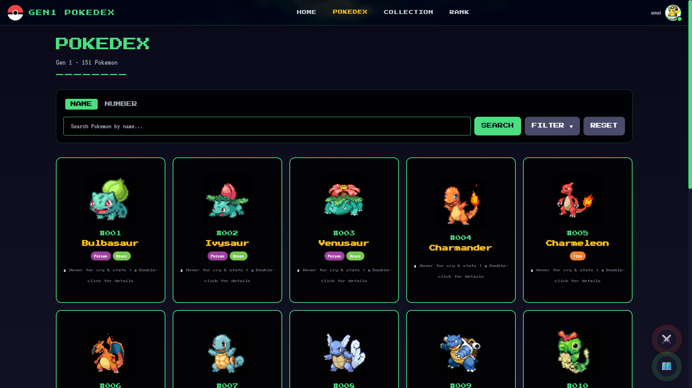

2. Pokemon Detail
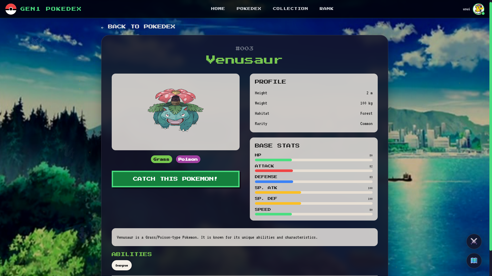

3. Collections View
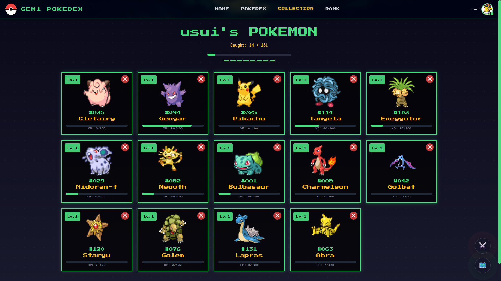

4. Battle Simulator
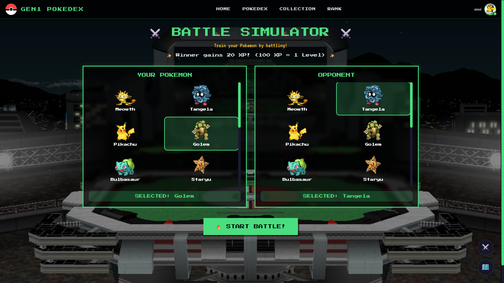

## User Features
1. User Dashboard
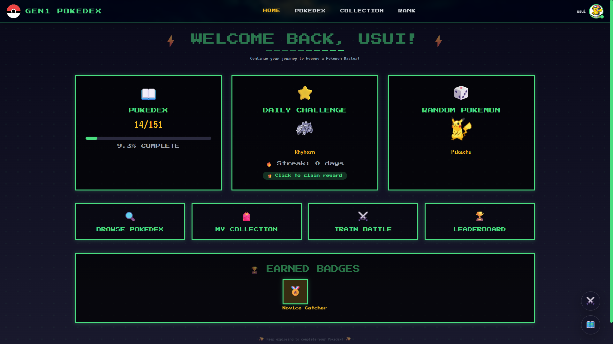

2. User Profile
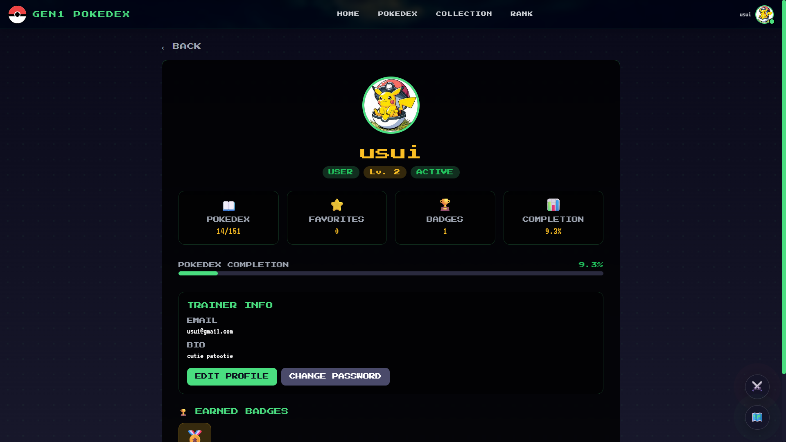

## Admin Features
1. Admin Dashboard
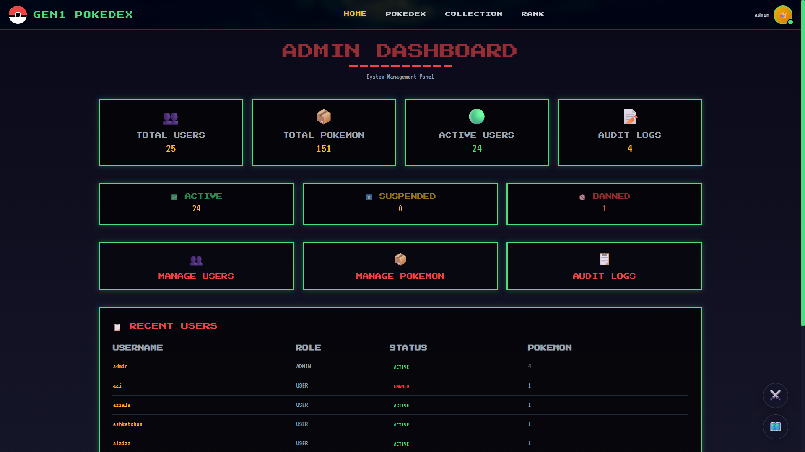

2. User Management
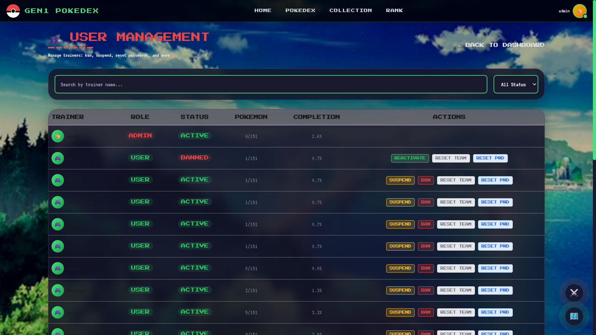

3. Pokemon Management
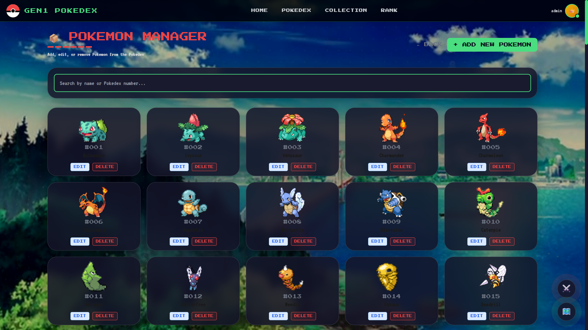
---

## 🔌 API Documentation

### Base API URL

```
http://localhost:8080/api
```

### Authentication

All protected endpoints require JWT token:

```
Authorization: Bearer YOUR_JWT_TOKEN
```

### Main Endpoints

**Authentication:**
- `POST /auth/login` - User login
- `POST /auth/forgot-password` - Password reset request
- `POST /auth/reset-password` - Reset password with token
- `POST /auth/change-password` - Change password (logged in)

**Pokemon:**
- `GET /pokemons` - List all Pokemon (paginated)
- `GET /pokemons/{id}` - Get Pokemon by ID
- `GET /pokemons/name/{name}` - Get Pokemon by name
- `GET /pokemons/search` - Advanced search

**User:**
- `GET /users/{username}/profile` - Get user profile
- `POST /users/{username}/catch/{pokemonId}` - Catch Pokemon
- `GET /users/{username}/collection` - View collection
- `POST /users/{username}/favorite/{userPokemonId}` - Add favorite
- `POST /battles/simulate` - Simulate battle

**Admin:**
- `GET /admin/users` - List all users
- `POST /admin/users/{username}/ban` - Ban user
- `POST /admin/pokemons` - Add new Pokemon
- `GET /admin/audit-logs` - View audit logs

**Full API Reference:** See [backend README](gen1pokedex/README.md)

---

## 📱 Frontend Documentation

Complete frontend guide with components, services, and styling:

**→ [Frontend README](gen1pokedex-frontend/README.md)**

Topics covered:
- Quick start
- Project structure
- Components overview
- Services & API integration
- State management
- Styling guide
- Development workflow
- Deployment

---

## 🖥️ Backend Documentation

Complete backend guide with architecture, features, and endpoints:

**→ [Backend README](gen1pokedex/README.md)**

Topics covered:
- Quick start
- Project overview
- API endpoints
- Testing guide
- Application flow
- Code quality
- Admin management
- Error handling

---

## 💻 Development Workflow

### 1. Setup (One-time)

```bash
# Clone repository
git clone https://github.com/YOUR_REPO/Generation1Pokedex.git
cd Generation1Pokedex

# Backend setup
cd gen1pokedex
mvn clean install
cd ..

# Frontend setup
cd gen1pokedex-frontend
npm install
cd ..
```

### 2. Daily Development

**Terminal 1 - Backend:**
```bash
cd gen1pokedex
./mvnw.cmd spring-boot:run
```

**Terminal 2 - Frontend:**
```bash
cd gen1pokedex-frontend
npm run dev
```

**Terminal 3 - Linting (optional):**
```bash
cd gen1pokedex-frontend
npm run lint -- --fix
```

### 3. Making Changes

Backend:
1. Edit Java files in `src/main/java/`
2. Changes auto-compile with Spring Boot
3. Refresh browser to test

Frontend:
1. Edit React/JSX files in `src/`
2. Vite auto-rebuilds (HMR)
3. Browser auto-refreshes

### 4. Before Committing

```bash
# Backend
cd gen1pokedex
mvn clean test

# Frontend
cd gen1pokedex-frontend
npm run lint
npm run build
```

### 5. Git Workflow

```bash
# Create feature branch
git checkout -b feature/your-feature-name

# Make changes and commit
git add .
git commit -m "Add feature: description"

# Push to remote
git push origin feature/your-feature-name

# Create pull request
# Get code reviewed
# Merge to main
```

---

## 🚀 Deployment Guide

### Frontend Deployment (Vercel/Netlify)

**Option 1: Vercel (Easiest)**

1. Connect GitHub repository to Vercel
2. Set environment variables:
   ```
   VITE_API_URL=https://your-backend-api.com
   ```
3. Deploy - auto-deploys on every push

**Option 2: Netlify**

```bash
# Build locally
npm run build

# Drag dist/ folder to Netlify
# Or use Netlify CLI:
netlify deploy --prod --dir=dist
```

### Backend Deployment

**Option 1: Heroku**

```bash
# Install Heroku CLI
heroku login
heroku create your-app-name

# Deploy
git push heroku main
```

**Option 2: Docker**

```bash
# Build image
docker build -t gen1pokedex .

# Run container
docker run -p 8080:8080 gen1pokedex
```

**Option 3: AWS/DigitalOcean**

Use their app deployment services or VPS with:
- Java runtime
- MySQL database
- Reverse proxy (Nginx)

### Database Setup (Production)

```sql
-- Create database
CREATE DATABASE gen1pokedex_prod CHARACTER SET utf8mb4;

-- Create user
CREATE USER 'app_user'@'localhost' IDENTIFIED BY 'secure_password';

-- Grant privileges
GRANT ALL PRIVILEGES ON gen1pokedex_prod.* TO 'app_user'@'localhost';
```

---

## 🔧 Troubleshooting

### Frontend & Backend Connection Issues

**Problem:** Can't login, "Cannot connect to server"

**Solution:**
1. Verify backend running: `http://localhost:8080`
2. Check API base URL in `services/api.js`
3. Check for CORS errors in console
4. Verify firewall isn't blocking port 8080

### Database Connection Issues

**Problem:** "Connection refused" when starting backend

**Solution:**
1. Verify MySQL is running
2. Check credentials in `application.properties`
3. Ensure database `gen1pokedex_db` exists
4. Check network connectivity

### Build Errors

**Frontend:**
```bash
# Clear cache and reinstall
rm -rf node_modules package-lock.json
npm install
npm run build
```

**Backend:**
```bash
# Clean and rebuild
mvn clean compile
mvn clean package
```

### Port Already in Use

**Frontend (5173):**
```bash
# Use different port
npm run dev -- --port 5174
```

**Backend (8080):**
```bash
# Edit application.properties
server.port=8081
```

---

## 🤝 Contributing

### Code Style

**Backend (Java):**
- Follow Spring Boot conventions
- Use meaningful variable names
- Comment complex logic
- Write unit tests

**Frontend (React):**
- Use functional components
- Meaningful component names
- Props validation
- Error handling

### Commit Messages

```
Format: [type] short description

Types:
  feat    - New feature
  fix     - Bug fix
  refactor - Code refactoring
  style   - Formatting
  docs    - Documentation
  test    - Tests

Examples:
  feat: Add Pokemon search filter
  fix: Fix battle XP calculation
  docs: Update README with screenshots
```

### Pull Request Process

1. Create feature branch
2. Make changes
3. Run tests and linting
4. Create pull request with description
5. Wait for code review
6. Address feedback
7. Merge when approved

---

## 📞 Support & Contact

For issues or questions:

1. **Check Documentation**
   - [Backend README](gen1pokedex/README.md)
   - [Frontend README](gen1pokedex-frontend/README.md)

2. **Check Troubleshooting Section** (above)

3. **Create GitHub Issue**
   - Include error message
   - Include steps to reproduce
   - Include environment info

4. **Development Team**
   - Backend lead: [Name]
   - Frontend lead: [Name]

---

## 📄 License

This project is licensed under the MIT License - see LICENSE file for details.

---

## 🎉 Project Status

| Component | Status | Version |
|-----------|--------|---------|
| Backend | ✅ Production Ready | 1.0.0 |
| Frontend | ✅ Development Ready | 1.0.0-alpha |
| Database | ✅ Initialized | 1.0.0 |
| Documentation | ✅ Complete | 1.0.0 |
| Testing | 🟡 In Progress | - |
| Deployment | 🟡 Planned | - |

---

## 📅 Timeline

- **December 2025** - Backend development started
- **January 2026** - Backend features completed
- **February 2026** - Frontend development started
- **March 2026** - Frontend MVP completed
- **April 2026** - Testing & bug fixes
- **May 2026** - Documentation finalized
- **June 2026** - Ready for development continuation

---

## 🙏 Acknowledgments

- Original Pokemon concepts from Nintendo/Gamefreak
- Generation 1 Pokemon data from PokeAPI
- Community feedback and testing

---

**Last Updated:** June 3, 2026  
**Maintained By:** Development Team  
**Repository:** [GitHub Link]

---

## Quick Links

- 🔗 [Backend README](gen1pokedex/README.md)
- 🔗 [Frontend README](gen1pokedex-frontend/README.md)
- 🔗 [API Postman Collection](gen1pokedex/docs/Gen1_Pokedex_API_Collection.postman_collection.json)
- 🔗 [Screenshots](docs/)
- 🔗 [Issues](../../issues)
- 🔗 [Pull Requests](../../pulls)

---

**Happy Pokemon Hunting! 🎮✨**
